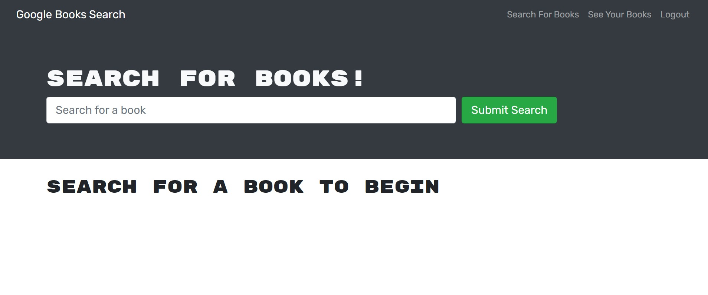

# Book Search Engine

## Description:
This application, built with React, uses a google books API to find and save your favorite books! Visit the deployed application [here](https://dante-the-peoples-champ.herokuapp.com/).

## Table of Contents:
* [License](#license)
* [Installation](#installation)
* [Usage](#usage)
* [How to Contribute](#how-to-contribute)

## License:
The MIT License

## Installation:
Clone the repository, run npm i in the terminal to install dependencies, then npm run start to launch the app.

## Usage:
Login, or create an account, and search for your favorite books!

## How to Contribute:
Contact me for contribution guidelines.

## Tests:
Not yet implemented.

## Questions:
For questions or comments, you can reach me via:

Email: tnoonan88@gmail.com

GitHub: [tnoonan88](https://github.com/tnoonan88)
